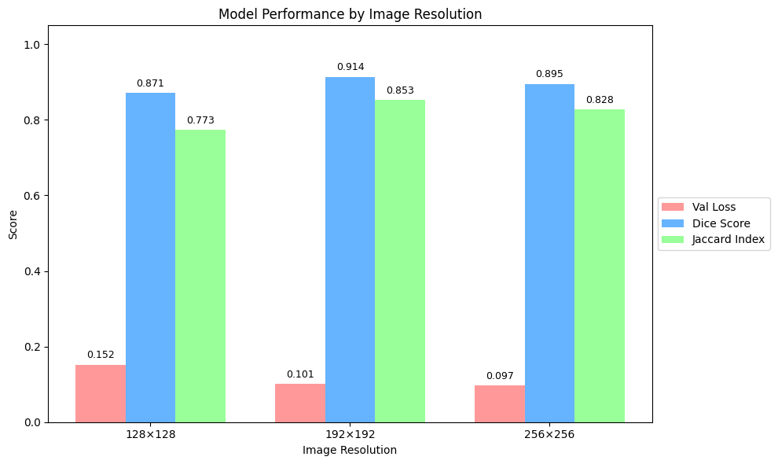
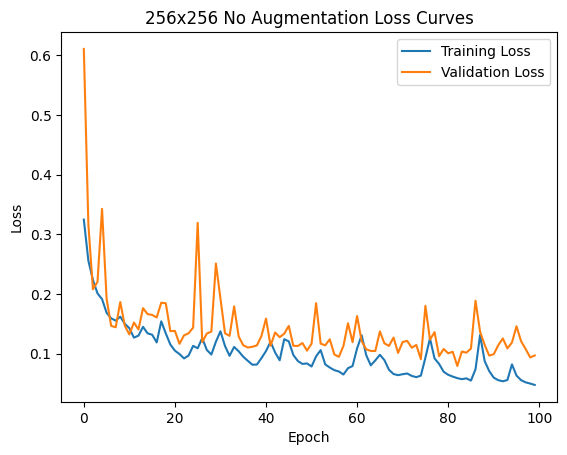
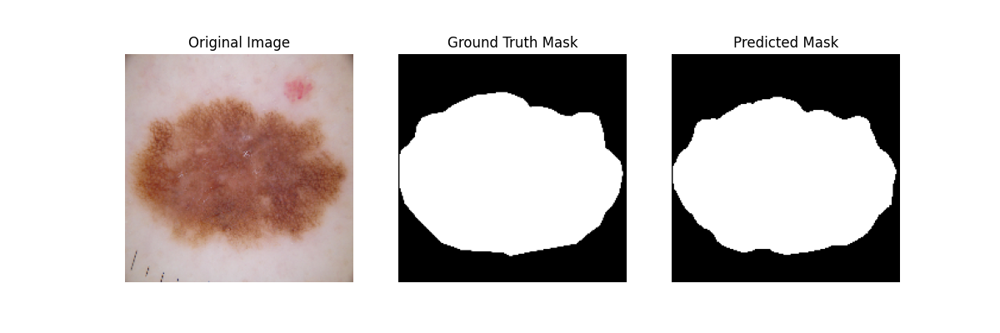
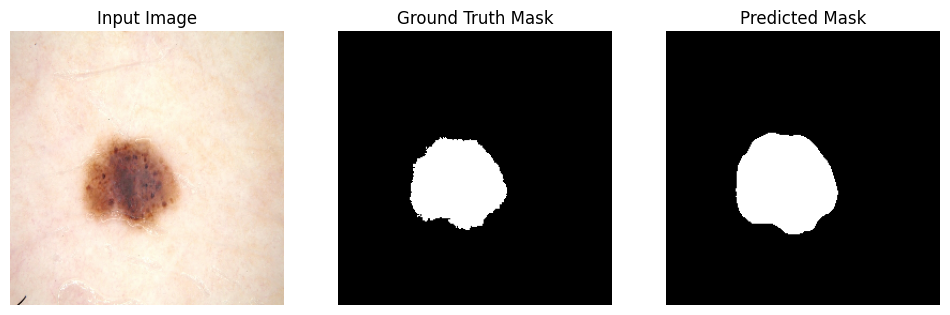

# Skin Lesion Segmentation with U-Net

This repository contains a TensorFlow/Keras implementation of U-Net for **skin lesion segmentation** using the ISIC 2018 dataset. The project applies deep learning to automate segmentation in dermoscopic images, an important step in computer-aided skin cancer diagnosis.

---

## Objectives

- Develop an end-to-end pipeline to segment skin lesions from dermoscopic images.
- Evaluate segmentation performance using **Jaccard Index (IoU)** and **Dice Score**.
- Explore potential for extending the project to lesion classification.

---

## Methodology

- U-Net model trained on ISIC 2018 dataset.
- Images and masks resized to 128×128, 192×192, and 256×256 for comparison.
- Preprocessing includes resizing and normalization.
- Custom TensorFlow pipeline with batch accumulation to handle GPU memory.
- Training loss: binary cross-entropy combined with Dice loss.
- Evaluation metrics: **Jaccard Index (IoU)** and **Dice Score**.

### Libraries Used

```python
import os
import numpy as np
import tensorflow as tf
from tensorflow.keras.optimizers import Adam
from keras_unet_collection import models
import matplotlib.pyplot as plt
from tensorflow.keras.models import load_model
from tensorflow.keras.callbacks import EarlyStopping
from tensorflow.keras import backend as K
from tqdm import tqdm
```

## Data Loading

-Images and masks are read from local directories and resized to the desired dimensions.
-Images and masks are aligned by sorting filenames and stacking into tensors.
-A validation split of 20% is applied using TensorFlow datasets.

## Model Architecture

-U-Net with configurable filter sizes.
-Sigmoid output for binary mask prediction.
-Batch normalization, max-pooling, and unpooling layers used.
-input sizes 128×128, 192×192, 256×256.

## Training

-Custom training loop with gradient accumulation for larger effective batch size.
-Early stopping implemented based on validation loss.
-Model checkpoint saved whenever validation loss improves.

## Evaluation Metrics

-Dice Score: Measures overlap between predicted and true masks.
-Jaccard Index (IoU): Intersection over Union, evaluates segmentation quality.

## Validation Metrics

| Input Size | Val Loss | Dice Score | Jaccard Index |
|------------|----------|------------|---------------|
| 128×128    | 0.152    | 0.871      | 0.773         |
| 192×192    | 0.101    | 0.914      | 0.853         |
| 256×256    | 0.097    | 0.895      | 0.828         |

## Images

### Final Metrics




### Sample Segmentation Results




## Acknowledgments

This project was supported by the Delaware INBRE program, with a grant from the National Institute of General Medical Sciences – NIGMS (P20 GM103446) from the National Institutes of Health and the State of Delaware.

Special thanks to Dr. Fatima Boukari for guidance and support.
Acknowledgment to Delaware State University and INBRE coordinator Rohina Niamat for resources.
